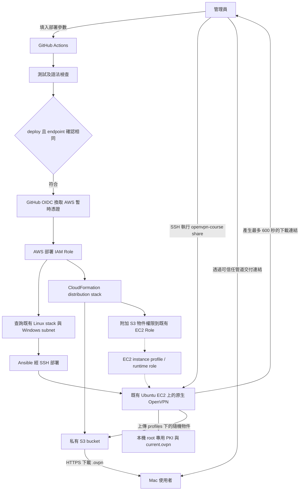
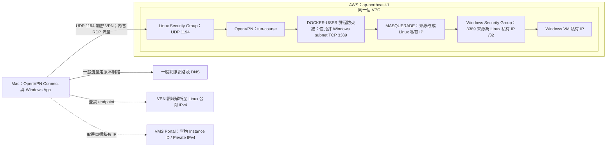
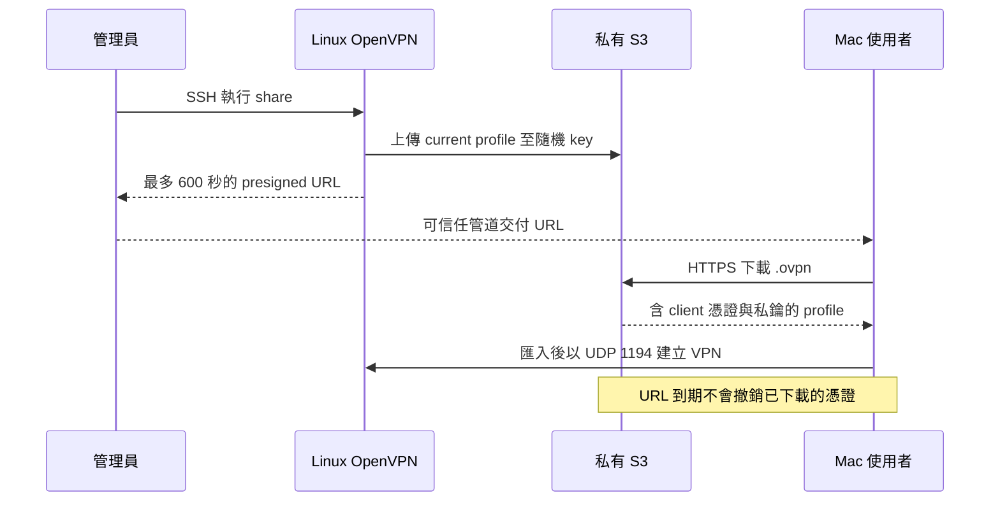

# OpenVPN 中文部署與 Mac 連線操作手冊

本手冊對應此 repository 的 [GitHub Actions workflow](../.github/workflows/deploy-openvpn.yml)、[Ansible playbook](../ansible_yaml/openvpn-server-playbook.yml) 與 [S3 CloudFormation 範本](../cloudformation/openvpn-distribution-template.yml)。外部安裝說明查核日期：2026-09-24。

這套服務把 OpenVPN 安裝在**既有 Ubuntu Linux EC2**，讓 Mac 經 VPN 連到 Windows VM 的私有 IP，只放行 TCP 3389 遠端桌面。它不是 AWS Client VPN，也不是有登入網頁的 OpenVPN Access Server。

最短流程：準備 AWS/GitHub 權限與網路 → Actions 執行 `validate` → 執行 `deploy`（自動建立 S3）→ 管理員 SSH 執行 `share` → Mac 下載 `.ovpn`、匯入 OpenVPN Connect → 使用 Windows App 連私有 IP。

## 1. 整個系統的架構

### 1.1 部署與憑證發放



S3 只負責短期發放設定檔，不轉送 VPN 或遠端桌面流量。CA 私鑰留在 Linux 主機，不上傳 S3；發放的 `.ovpn` 含 client 私鑰，仍須當成密碼保護。

### 1.2 實際 VPN / RDP 連線



VPN 只推送 Windows subnet 路由；其他網際網路流量不經這台 VPN。防火牆阻擋經 tunnel 存取 Linux 本機服務、其他 VPN client，以及 Windows 的非 3389 轉送流量。Windows 看到的來源是 Linux 私有 IP，因此 Windows SG 應允許該 IP 的 `/32`，不是 `vpn_cidr`。回程藉由 NAT 狀態返回，不需為這個 VPN 位址池新增 VPC route table 路由。

VMS Portal 提供主機查詢，不是 VPN 登入服務，也不在 RDP 資料路徑上。現有 Docker/Traefik 可與原生 OpenVPN 共存；部署依賴主機既有 `iptables-nft` 與 `FORWARD → DOCKER-USER` 路徑。

## 2. 部署前要準備什麼

| 項目 | 要確認的內容 | 是否由這個 workflow 建立 |
| --- | --- | --- |
| Linux EC2 | Ubuntu、SSH 使用者 `ubuntu`，具有 sudo 權限；既有 stack outputs 含 `InstancePublicIp`、`InstanceId` | 否 |
| Windows EC2 / subnet | Windows 已開啟 RDP，與 Linux 在同一 VPC，兩者私有網路可達 | 否 |
| VPN endpoint | 穩定 DNS 名稱或 IPv4，指向 Linux 公開 IPv4 | 否；不建立 DNS / Elastic IP |
| GitHub environment | `a11y-village-production`，以及其必要保護規則 | 需先設定 |
| GitHub AWS OIDC role | 可供 workflow 假設的部署角色 | 否 |
| EC2 runtime role | 既有 `coseeing-ec2-common`，透過 instance profile 掛到 Linux | 不建立角色、不自動掛載；只附加 S3 policy |
| 專用 S3 bucket | 私有設定檔發放空間 | **是，deploy 自動建立或更新** |
| OpenVPN / CA / client profile | Linux 上的套件、設定、防火牆及 PKI | 是 |

先在 AWS Console 選 Tokyo / `ap-northeast-1`。目前區域、distribution stack 名稱和 runtime role 名稱都寫在 workflow 中，**不是 Run workflow 可填的參數**。

### 網路必備條件

1. Linux SG：允許預定使用者來源的 **UDP 1194**。SSH 部署另需讓 GitHub runner 能連到 Linux 公開 IP 的 **TCP 22**。
2. Windows SG：允許 **TCP 3389**，來源填 Linux 的 **私有 IPv4 `/32`**，例如 `10.0.1.10/32`。
3. 若要求只能經 VPN 使用 RDP，另行移除 Windows SG 對公開網路開放的 3389 規則。workflow 不會代做。
4. 確認 route table、Network ACL、Linux 與 Windows 防火牆允許必要流量；Linux 也需能下載套件並以 HTTPS 存取 S3。
5. DNS 指向正確公開 IP。若使用會代理 HTTP 的 DNS 服務，VPN 名稱須走可直接到達主機的 DNS 解析；此服務是 UDP 1194。

這個 workflow 不調整 Security Group、NACL、route table、Windows 設定或 Docker daemon。它也不會自動核對 Linux 所在 VPC 是否等於所選 Windows subnet 的 VPC，管理員必須先確認。

## 3. GitHub Actions 每個輸入參數的意思

入口：Repository → **Actions → Validate or deploy course OpenVPN → Run workflow**。先選擇包含此 workflow 的 branch。

| 參數 | 意義與填法 | 範例／預設 | 去哪裡取得 |
| --- | --- | --- | --- |
| `action` | `validate` 只做程式測試與靜態檢查；`deploy` 才查 AWS 並部署 | 先 `validate`，確認後用 `deploy` | 下拉選單 |
| `stack_name` | **現有 Linux EC2** 的 CloudFormation stack，不是 Windows stack，也不是 S3 stack | 預設 `coseeing-stack-v2` | CloudFormation → Linux stack → Outputs，核對 Instance ID / 公開 IP |
| `vpn_endpoint` | Mac 實際連線的穩定網域或 IPv4。不可加 `https://`、路徑或 `:1194` | 例如 `vpn.example.com` | DNS 管理者或 Linux EC2 公開 IPv4 |
| `windows_subnet_id` | 要允許 RDP 的 Windows 所在 subnet ID，不是 CIDR，也不是 SG ID | 例如 `subnet-0123456789abcdef0` | EC2 → Windows instance → Networking → Subnet ID |
| `vpn_cidr` | 分配給 VPN client 的虛擬 IPv4 網段，不是 VPC 或 Windows subnet | 預設 `10.250.0.0/24` | 管理員規劃；需用 RFC1918 私有網段，prefix `/16`～`/29` |
| `client_days` | 新建共享 client 憑證的有效天數，整數 `1`～`365` | 預設 `30` | 依課程長度安排 |
| `confirm_endpoint` | 部署確認，必須與輸入的 `vpn_endpoint` **逐字相同**，包含大小寫及標點 | `vpn.example.com` | 複製本次 `vpn_endpoint` |

`vpn_cidr` 不可與 AWS VPC / Windows 網段重疊，也應避開使用者家中、公司和其他 VPN 網段；後者 workflow 無法代查。`windows_subnet_id` 只接受一個 subnet，若目標 Windows 分散在其他 subnet，目前部署不會一起放行。

以下只是填寫示意，請換成真實資源：

```text
action: deploy
stack_name: coseeing-stack-v2
vpn_endpoint: vpn.example.com
windows_subnet_id: subnet-0123456789abcdef0
vpn_cidr: 10.250.0.0/24
client_days: 30
confirm_endpoint: vpn.example.com
```

注意三個行為：

- `validate` 不使用 AWS 憑證，也不驗證你填的 subnet / endpoint 是否真實可用；playbook syntax check 使用測試值。
- 確認字串缺漏或不同時，`deploy` job 會 **skipped**，不能把整個 run 顯示成功理解成已部署。
- 既有 PKI 會保留；重跑部署並改 `client_days` **不會重簽或延長現有憑證**。要換有效期，使用第 8 節的 `rotate`。

## 4. cred 到底是哪一種？去哪裡拿？

| 憑證／帳密 | 用途 | 取得方式 | 交給 Mac 使用者？ |
| --- | --- | --- | --- |
| `AWS_GITHUB_ACTION_ROLE` | Actions 經 OIDC 取得 AWS 部署權限 | IAM → Roles → 部署角色 → 複製 ARN | 否 |
| `EC2_SSH_KEY` | Actions / 管理員 SSH 登入 Linux | 建立 Linux EC2 時使用的 SSH private key，由保管者提供 | 否 |
| EC2 runtime 暫時憑證 | Linux 上傳 S3、簽下載網址 | EC2 instance profile 提供；不用手填 access key | 否 |
| `course-vpn.ovpn` | Mac 的 VPN 連線憑證與設定 | 部署後由管理員執行 `share` 或 `export` | **是** |
| Windows username / password | 登入遠端 Windows 桌面 | Windows 管理員提供；本專案 Windows build 的相關來源見下文 | **是，獨立交付** |
| VMS Portal 帳密 | 查詢 Windows Instance ID / Private IPv4 | Portal 管理員提供 | 有使用 Portal 才需要 |

### 4.1 GitHub secrets 與 OIDC

在 Repository → Settings → Environments → `a11y-village-production` → Environment secrets，新增或確認以下 secrets；也可使用該 environment 能存取的 repository secrets：

```text
AWS_GITHUB_ACTION_ROLE = arn:aws:iam::<AWS_ACCOUNT_ID>:role/<DEPLOY_ROLE_NAME>
EC2_SSH_KEY = 對應 Linux EC2 的完整 SSH 私鑰內容
```

第一個值是 **Role ARN**，不是 Access Key ID。第二個是私鑰內容，不是 `.pem` 路徑或公鑰。已儲存的 GitHub secret 不能在介面重新讀回明文；請向原保管者取得或依管理程序更換。AWS EC2 不提供重新下載原始私鑰的功能。

如果 AWS 尚未設定 GitHub OIDC，請由 IAM 管理員依 [GitHub 官方 AWS OIDC 指南](https://docs.github.com/en/actions/how-tos/secure-your-work/security-harden-deployments/oidc-in-aws) 建立 provider 與部署角色。此 workflow 使用 environment，因此信任條件應對應：

```text
provider: token.actions.githubusercontent.com
aud: sts.amazonaws.com
sub: repo:<OWNER>/<REPO>:environment:a11y-village-production
```

這是信任條件摘要，不是完整 IAM policy。角色還需要可查 CloudFormation stack、EC2 subnet/VPC，以及建立／更新專用 distribution stack 所涉及的 S3 bucket、bucket policy 與既有角色 inline policy 等權限。具體 policy 應限定本次資源；`CAPABILITY_NAMED_IAM` 只是 CloudFormation 的能力確認，**不會自行授予 IAM 權限**。OpenVPN workflow 不會替自己建立這個部署角色。

### 4.2 VPN client 憑證

`.ovpn` 已內嵌 CA 憑證、client 憑證、client 私鑰及 `tls-crypt` key。這份設定使用憑證驗證，沒有另外設定 VPN username/password，也沒有私鑰密碼提示所需的密碼。若 app 要求帳密，先確認匯入方式及檔案，勿填 AWS 或 Windows 密碼。

目前所有 Mac 共用同一張 client 憑證，可以同時連線，但無法用該憑證識別每位學員；撤銷時會影響所有人。

### 4.3 Windows 的帳號密碼

由管理員提供與該 VM 相符的 Windows 帳密；OpenVPN 不產生 Windows 密碼。本專案 Windows AMI build 文件記載 Secrets Manager 路徑為 `windows-a11y/<ami_name>/coseeing` 與 `windows-a11y/<ami_name>/user`，內容是 `username`、`password` JSON。授權管理員可在 Tokyo 區域的 Secrets Manager 查看，需核對 VM 所用 AMI 與後續是否改密碼，不能隨便選一組。詳見 [Windows AWS 設定文件](windows-a11y-aws-manual-setup.md)。

## 5. S3 要手動建立嗎？

**正常情況不需要。** `deploy` 會先執行 CloudFormation，建立／更新固定名稱的 stack `openvpn-course-profile-distribution`，由 AWS 自動產生 bucket 名稱，再把輸出 `ProfileBucketName` 傳给 Ansible。

範本提供：

- Block Public Access 全開、Bucket owner enforced（停用 ACL）、SSE-S3 AES256 加密。
- 拒絕非 HTTPS 存取；`profiles/` 下 presigned GET 的簽章年齡超過 `600000 ms` 即拒絕。
- `profiles/` 物件滿一天後符合 lifecycle 到期條件；實際刪除是非同步，不是精準 24 小時清除。
- 把 `s3:PutObject`、`s3:GetObject`、`s3:DeleteObject` 限定在該 bucket 的 `profiles/*`，附加到既有 `coseeing-ec2-common` role。

這不會建立或掛載 EC2 instance profile。若 Linux 用的不是上述 role，即使 bucket 建好了，上傳也可能失敗。部署還會用不含 VPN 憑證的測試物件驗證上傳、預簽下載與內容比對，並嘗試清理。

### 5.1 查看自動建立的 bucket

到成功 deploy 的 Actions run → Summary 看 `Profile bucket`；或 AWS Console → CloudFormation → `openvpn-course-profile-distribution` → Outputs → `ProfileBucketName`。

也可在**有 AWS 管理權限的本機終端機**執行：

```bash
aws cloudformation describe-stacks \
  --region ap-northeast-1 \
  --stack-name openvpn-course-profile-distribution \
  --query 'Stacks[0].Outputs[?OutputKey==`ProfileBucketName`].OutputValue | [0]' \
  --output text
```

### 5.2 想先手動建立發放資源

仍使用同一份 CloudFormation 範本，比單獨在 S3 Console 建 bucket 更能保留完整 policy 與 lifecycle。在 repository 根目錄、已登入 AWS CLI 的管理員終端機執行以下指令；這會實際建立／更新 AWS 資源：

```bash
aws cloudformation deploy \
  --region ap-northeast-1 \
  --stack-name openvpn-course-profile-distribution \
  --template-file cloudformation/openvpn-distribution-template.yml \
  --capabilities CAPABILITY_NAMED_IAM \
  --parameter-overrides ExistingRoleName=coseeing-ec2-common \
  --no-fail-on-empty-changeset
```

之後 Actions 會更新同一 stack。這一步只建立發放資源，還沒安裝 OpenVPN、產生 profile 或上傳真正的 `.ovpn`。

目前 Actions **沒有自訂 bucket input**。自己另建一個 bucket 不會被 workflow 自動採用；若要支援既有 bucket、其他 role 或多個獨立課程環境，需要另外調整部署設定。固定 stack 與共享 bucket 也不是每次 run 各建一組。

## 6. 正式部署與拿到 `.ovpn`

### 6.1 管理員執行部署

1. 完成第 2～4 節的 prerequisites，核對 DNS、Linux IP、Windows subnet、CIDR 和憑證天數。
2. 在 Actions 用 `action=validate` 跑一次，確認檢查通過。
3. 再開 Run workflow，改成 `deploy`，輸入完全相同的 `confirm_endpoint`。
4. 若 environment 設了 reviewer，完成該 environment 的審核。
5. 確認 `deploy` job 實際執行成功，Summary 有 bucket 名稱和 remote checks passed。

remote checks 會看 OpenVPN / firewall 的 systemd 啟用狀態、UDP 1194、IPv4 forwarding 及防火牆鏈。它沒有從外網 Mac 做真正 VPN / RDP 測試，也沒有自動把 `.ovpn` 發給學員。

### 6.2 建立最多 10 分鐘的下載連結

管理員在 **Mac 終端機**登入 Linux；把範例中的 key 路徑與主機 IP 換成真實值：

```bash
chmod 600 "$HOME/.ssh/linux-ec2.pem"
ssh -i "$HOME/.ssh/linux-ec2.pem" ubuntu@LINUX_PUBLIC_IPV4
```

第一次 SSH 時，先核對管理員提供的主機 fingerprint。登入後，在 **Linux shell** 執行：

```bash
sudo openvpn-course status
sudo openvpn-course share
```

`share` 會上傳目前 profile、輸出下載網址和最晚到期時間。把網址透過可信任管道交給學員，學員於有效時間內用瀏覽器下載。不需要給學員 S3 登入權限或 AWS key，也不需要把 bucket 設成公開。

每次 `share` 會嘗試刪除上次記錄的物件，因此**重新 share 可能讓上一個連結提早失效**；同一批人應使用同一次產生的連結。清理或上傳失敗時，重新執行並使用新連結。

下載 URL 最多有效 600 秒；若簽署用的 EC2 暫時憑證先到期，也可能更早失效。**URL 到期只阻止新下載；已下載的 `.ovpn` 仍可使用，直到 client 憑證到期或被撤銷。** 這兩個期限彼此獨立。[AWS presigned URL 說明](https://docs.aws.amazon.com/AmazonS3/latest/userguide/using-presigned-url.html)



### 6.3 不經 S3：管理員透過 SSH 匯出

在 **Linux shell** 執行（目的檔若已存在，預設會拒絕覆寫）：

```bash
sudo openvpn-course export /home/ubuntu/course-vpn.ovpn
```

再於 **Mac 的另一個終端機**執行：

```bash
mkdir -p "$HOME/.course-vpn"
chmod 700 "$HOME/.course-vpn"
scp -i "$HOME/.ssh/linux-ec2.pem" \
  ubuntu@LINUX_PUBLIC_IPV4:/home/ubuntu/course-vpn.ovpn \
  "$HOME/.course-vpn/course-vpn.ovpn"
chmod 600 "$HOME/.course-vpn/course-vpn.ovpn"
```

確認下載成功後，回 Linux 刪除這份匯出副本：`rm /home/ubuntu/course-vpn.ovpn`。不要刪除 `/var/lib/openvpn-course/current.ovpn` 或 PKI。匯入完成後，依組織規範清除 Mac 的額外下載副本；app 自身仍保有連線憑證。

## 7. Mac 安裝 client、匯入與使用遠端桌面

### 7.1 安裝 OpenVPN Connect

1. 到 [OpenVPN Connect for macOS 官方頁](https://openvpn.net/connect-docs/connect-for-macos.html) 下載。
2. 在 Apple 選單 → 關於這台 Mac，確認是 Apple 晶片或 Intel，選擇相符安裝檔。
3. 開啟下載的 `.dmg`，執行其中安裝程式，依提示完成安裝；需要時輸入 **Mac 本機管理員**密碼，允許所需 VPN 權限。
4. 開啟「應用程式」中的 OpenVPN Connect。

安裝介面依版本可能略有不同，參考 [官方 macOS 安裝指南](https://openvpn.net/connect-docs/macos-installation-guide.html)。該指南也涵蓋 Access Server；本專案使用下面的檔案匯入方式，沒有 Access Server 網頁可登入。

### 7.2 匯入 profile

1. 從管理員的 S3 連結先下載 `course-vpn.ovpn`，確認不是錯誤訊息 XML、HTML 或被加上 `.txt` 的檔案。
2. 在 OpenVPN Connect 選 **Import Profile → File / Upload File**，選取 `.ovpn`；也可將檔案拖入 app。不要把 S3 URL 當成 VPN server URL 匯入。
3. 為 profile 命名，例如「課程 Windows VPN」，完成匯入，打開連線開關。
4. 等待顯示 **Connected**，再使用 Windows App。

此 profile 已內嵌 client certificate，不必另外取得 `.crt` / `.key`。詳見 [官方 profile 匯入說明](https://openvpn.net/connect-docs/import-profile.html)。

### 7.3 找到 Windows 私有 IP 與登入

1. 登入 VMS Portal。一般使用者輸入完整 EC2 Instance ID；管理員也可從 VM 列表查看。
2. 複製 **Private IPv4**，並確認 VM 為 running。不要使用 Public IPv4 來驗證 VPN 存取。
3. 從 Mac App Store 安裝 Microsoft **Windows App**（新版遠端桌面用戶端）。
4. 新增 PC，在 PC name 填 Windows 私有 IP，例如 `10.0.8.25`，輸入管理員交付的 Windows 帳號密碼後連線。這裡的密碼不是 Mac 密碼、Portal 密碼或 VPN 憑證。

Windows App 的 PC 連線操作可對照 [Microsoft 官方說明](https://learn.microsoft.com/en-us/windows-app/get-started-connect-devices-desktops-apps)。

## 8. 憑證更新與日常維運

下列指令都在 **Linux shell** 執行：

| 指令 | 用途 |
| --- | --- |
| `sudo openvpn-course status` | 檢查服務、1194 listener、網段、連線數、共享憑證到期時間 |
| `sudo openvpn-course logs` | 查看最近 100 筆服務紀錄 |
| `sudo openvpn-course share` | 發放目前 profile 的新下載連結，不延長憑證效期 |
| `sudo openvpn-course rotate --days 30` | 產生新的 30 天 client 憑證，撤銷原共享憑證 |

`rotate` 會要求輸入精確文字 `ROTATE course-shared`。這是**全體換證**，既有連線可能中斷，所有人都必須取得新 `.ovpn`。完成後再跑 `share`、交付新檔，請 Mac 使用者替換舊 profile。

`share` 與 `rotate` 有互斥鎖，若出現 `another rotate or share operation is already in progress`，待前一操作完成再重試。不要手動刪除 PKI；現有設計未提供外部 CA 備份，主機重建且 PKI 遺失時，須重新部署並發放新 profile。

## 9. 驗收與常見問題

### 從 Mac 做實際驗收

以下範例 IP `10.0.8.25` 須換成目標 Windows 私有 IP：

```bash
# VPN 連線前後各跑一次：一般網路出口 IPv4 預期不變
curl -4 https://checkip.amazonaws.com

# VPN 連線後：預期可連 TCP 3389
nc -vz -w 5 10.0.8.25 3389

# 預期失敗或逾時：非 RDP 流量不應放行
nc -vz -w 5 10.0.8.25 445
```

接著用 Windows App 真正登入。Ping 失敗不代表 VPN 壞掉，因為設計只轉送 TCP 3389。單看路由存在也不能證明 RDP 可用。

| 現象 | 優先確認 |
| --- | --- |
| Actions 成功但沒有安裝 | 是否只跑 `validate`，或 `confirm_endpoint` 不同導致 `deploy` skipped |
| OIDC / AssumeRole 失敗 | Role ARN、OIDC provider、environment 對應的 `sub` 信任條件 |
| 建 bucket / policy AccessDenied | 部署 role 的 CloudFormation、S3 與 IAM 權限；不是 Mac 的問題 |
| S3 測試或 `share` AccessDenied | Linux 是否掛正確 runtime role、物件 policy 是否存在、是否有其他顯式 Deny |
| SSH timeout / Permission denied | Linux 公開 IP、TCP 22、runner 可達性、`ubuntu` 帳號與 private key |
| Firewall preflight 失敗 | `iptables-nft`、`DOCKER-USER` 與 `FORWARD` 是否連接；不要靠清空主機防火牆處理 |
| 下載連結失效 | 超過 10 分鐘、暫時 AWS 憑證提早到期，或管理員再次 share 刪除了舊物件；請管理員發新連結 |
| VPN 連不上 | endpoint DNS / 公開 IP、UDP 1194、OpenVPN 狀態、profile 是否過期或已輪替 |
| VPN 已連線但 RDP 失敗 | VM running、使用私有 IP、目標在設定 subnet、Windows RDP 開啟、SG 允許 Linux 私有 IP `/32`、NACL 與 Windows 防火牆 |
| 換網路後路由異常 | Mac 所在 LAN 或其他 VPN 是否與 Windows / VPN CIDR 重疊 |
| 修改 `client_days` 沒有效果 | 既有憑證不會自動更新，使用 `rotate` 後重新匯入 |

本文件依据 repository 設定與官方 client 文件整理；這次只新增文件，沒有操作 AWS、部署主機、讀取真實 secrets、簽發下載連結或在 Mac 上安裝軟體。Actions 靜態檢查、遠端服務檢查、Mac VPN 連線與 Windows RDP 登入是不同驗證層級，實際環境結果須分別確認。

## 10. 維護時應對照的原始檔

- [GitHub Actions：參數、Secrets、部署與遠端檢查](../.github/workflows/deploy-openvpn.yml)
- [輸入檢查：CIDR、endpoint、憑證天數](../scripts/validate-openvpn-inputs.py)
- [S3 bucket、lifecycle 與 IAM policy](../cloudformation/openvpn-distribution-template.yml)
- [Ansible：安裝、PKI 與 S3 測試](../ansible_yaml/roles/openvpn_server/tasks/main.yml)
- [Server 設定與推送路由](../ansible_yaml/roles/openvpn_server/templates/course.conf.j2)
- [Client profile 格式](../ansible_yaml/roles/openvpn_server/templates/course.ovpn.j2)
- [NAT 與 Linux tunnel input 防火牆](../ansible_yaml/roles/openvpn_server/templates/course-firewall.nft.j2)
- [Docker forwarding 防火牆](../scripts/openvpn-course-firewall)
- [status / export / share / rotate / logs 指令](../scripts/openvpn-course)
- [英文維運手冊與完整移除順序](openvpn-course-operations.md)
